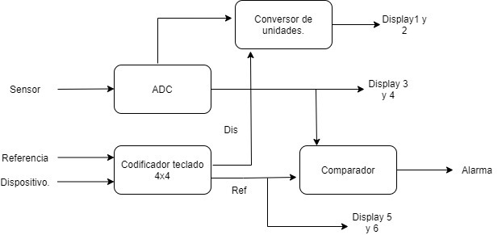
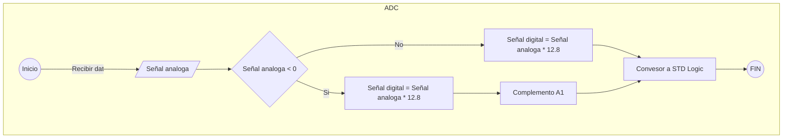
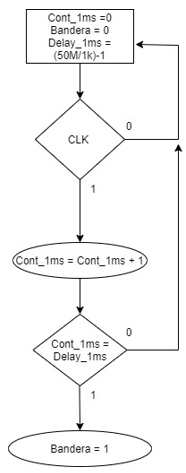
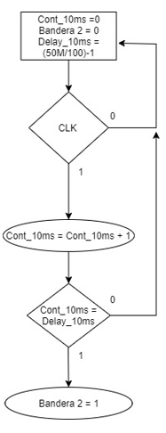
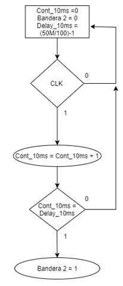
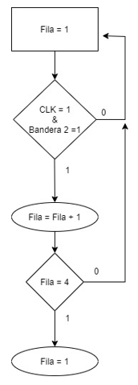
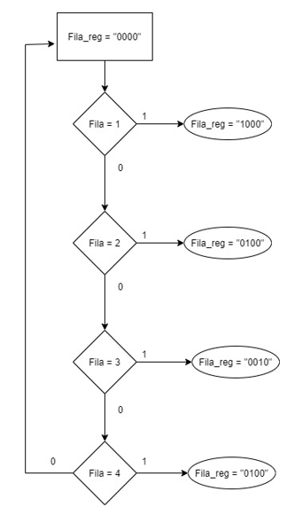
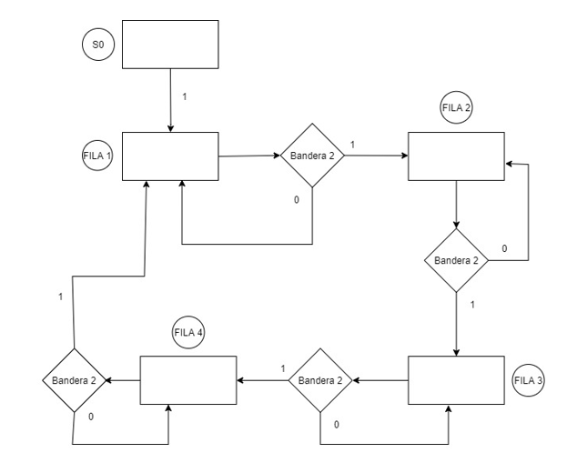
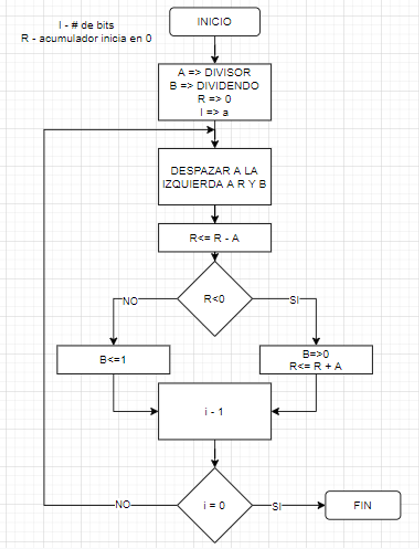
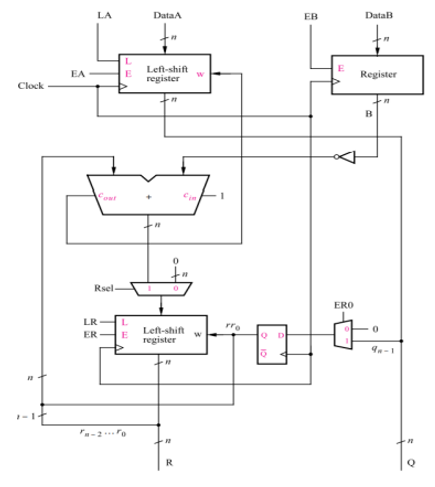

# Primer avance. Sistemas digitales programables. Universidad Autonoma de Occidente. 2021.

## Análisis de la entradas y salidas del sistema.

| Entradas | Salidas       |
| -------- | ------------- |
| ClK      | MEDIDA (Lx,W) |
| RESET    | ALARMA        |
| LUX      | REFERENCIA    |
| COLUMNA  | -             |

## Diagrama de Bloques.



## Seudocódigo de la Función Principal y de Funciones intermedias que fueron necesario construir.

### Seudocódigo de funcion Principal

| Entradas | Salidas         |
| -------- | --------------- |
| ClK      | MEDIDA (Lx,W)   |
| RESET    | ALARMA          |
| LUX      | REFERENCIA (Lx) |
| COLUMNA  | -               |

Entidad

```vhd
LIBRARY ieee;
USE ieee.std_logic_1164.ALL;
USE ieee.numeric_std.ALL;

ENTITY PRINCIPAL IS
  PORT (
    clk, reset: STD_LOGIC_VECTOR
    lux : IN real RANGE NVDC TO PVDC;
    columna : IN STD_LOGIC_VECTOR(3 DOWNTO 0);
    medida, referencia : OUT STD_LOGIC_VECTOR(7 DOWNTO 0);
    alarma : BIT;
  );
END ENTITY;
```

Posible codificación

```vhd
ARCHITECTURE  OF PRINCIPAL IS
    VARIABLE EficienciaLuminica, CambiarReferencia, Equivalencia : BIT;
    VARIABLE EficienciaLuminosa, watt : STD_LOGIC_VECTOR;
    VARIABLE TecladoCount, N : INTEGER;

    ADC := ConversorADC real(lux, dlux);

    Referencia:
    --CambiarReferencia es la activacion de la letra A
    process (CambiarReferencia, columna, clk_1Hz)
        IF (CambiarReferencia == 1 && TecladoCount <3) THEN
            IF (clk_1Hz 'Event And clk_1Hz = '1') THEN
                TecladoCount := TecladoCount + 1;
                N := 3-TecladoCount;
                NuevaReferencia(N) := funcion(tecla);
            END IF;
        ELSE
            CambiarReferencia := 0;
            TecladoCount := 0;
        END IF;
    end process Referencia;

    EficienciaLuminica:
    --EficienciaLuminica es la activacion de la letra B
    IF(EficienciaLuminica == '1') THEN
        EficienciaLuminosa := '1011010' --Led
    ELSE
        EficienciaLuminosa := '10100' --Halógena
    END IF;

    Equivalente: CalcularWatt port map (dlux,EficienciaLuminosa, watt)

    Mostrar:
    process (Equivalencia, watt)
        IF (Equivalencia == '1') THEN
            medida <= dlux;
        ELSE
            medida <= watt;
        END IF
    end process Mostrar;

    Alarmar:
    process (dlux)
        IF (dlux >= referencia) THEN
            alarma <= '1';
        ELSE
            alarma <= '0';
        END IF
    end process Alarmar;

END original;
```

### Seudocódigo de funcion ADC

Relacion de datos iniciales

| Entradas  | Salidas |
| --------- | ------- |
| Analogico | Digital |

Entidad

```vhd
LIBRARY ieee;
USE ieee.std_logic_1164.ALL;
USE ieee.numeric_std.ALL;

ENTITY ADC_8_bit IS
  PORT (
    analog_in : IN real RANGE NVDC TO PVDC;
    digital_out : OUT STD_LOGIC_VECTOR(7 DOWNTO 0)
  );
END ENTITY;
```

Posible codificación

```vhd
ARCHITECTURE original OF ADC_8_bit IS

  CONSTANT conversion_time : TIME := 25 ns; -- Muestreo

  -- Estados
  SIGNAL instantly_digitized_signal : STD_LOGIC_VECTOR(7 DOWNTO 0);
  SIGNAL delayed_digitized_signal : STD_LOGIC_VECTOR(7 DOWNTO 0);

  -- Funcion de conversion

  FUNCTION ADC_8b_10v_bipolar (
    analog_in : real RANGE NVDC TO PVDC
  ) RETURN STD_LOGIC_VECTOR IS
    CONSTANT max_abs_digital_value : INTEGER := 128;
    VARIABLE analog_signal : real;
    VARIABLE digitized_signal : INTEGER;
    VARIABLE digital_out : STD_LOGIC_VECTOR(7 DOWNTO 0);
  BEGIN
    analog_signal := real(analog_in);

    IF (analog_signal < 0.0) THEN -- i/p = -ve
      digitized_signal := INTEGER(analog_signal * 12.8); - escalamos
      IF (digitized_signal <- (max_abs_digital_value)) THEN
        digitized_signal := - (max_abs_digital_value);
      END IF;
    ELSE -- i/p = +ve
      digitized_signal := INTEGER(analog_signal * 12.8); - escalamos
      IF (digitized_signal > (max_abs_digital_value - 1)) THEN
        digitized_signal := max_abs_digital_value - 1; -- Complemento A1
      END IF;
    END IF;

    digital_out := STD_LOGIC_VECTOR(to_signed(digitized_signal, digital_out'length));
    RETURN digital_out;
  END ADC_8b_10v_bipolar;

BEGIN

END original;
```

### Seudocódigo de funcion Teclado

| Entradas | Salidas |
| -------- | ------- |
| Columnas | Digito  |
| Filas    | -       |

Tabla de funcionamiento

| TECLA PRESIONADA | TECLA_PRES |
| ---------------- | ---------- |
| 0                | x"0"       |
| 1                | x"1"       |
| 2                | x"2"       |
| 3                | x"3"       |
| 4                | x"4"       |
| 5                | x"5"       |
| 6                | x"6"       |
| 7                | x"7"       |
| 8                | x"8"       |
| 9                | x"9"       |
| A                | x"A"       |
| B                | x"B"       |
| C                | x"C"       |
| D                | x"D"       |
| \*               | x"E"       |
| #                | x"F"       |

Posible codificación

```vhd

library IEEE;
use IEEE.STD_LOGIC_1164.ALL;

entity TECLADO_MATRICIAL is

	PORT(
	CLK 		  : IN  STD_LOGIC; 						  --RELOJ FPGA
	COLUMNAS   : IN  STD_LOGIC_VECTOR(3 DOWNTO 0); --PUERTO CONECTADO A LAS COLUMNAS DEL TECLADO
	FILAS 	  : OUT STD_LOGIC_VECTOR(3 DOWNTO 0); --PUERTO CONECTADO A LA FILAS DEL TECLADO
	BOTON_PRES : OUT STD_LOGIC_VECTOR(3 DOWNTO 0); --PUERTO QUE INDICA LA TECLA QUE SE PRESIONA
	IND		  : OUT STD_LOGIC							  --BANDERA QUE INDICA CUANDO SE PRESIONA UNA TECLA (SOLO DURA UN CICLO DE RELOJ)
   );

end TECLADO_MATRICIAL;

architecture Behavioral of TECLADO_MATRICIAL is

	CONSTANT DELAY_1MS  : INTEGER := 49999; --(FREQ_CLK/1000)-1
	CONSTANT DELAY_10MS : INTEGER := 499999; -- (FREQ_CLK/100)-1

	SIGNAL CONTA_1MS 	: INTEGER RANGE 0 TO DELAY_1MS := 0;
	SIGNAL BANDERA 	: STD_LOGIC := '0';
	SIGNAL CONTA_10MS : INTEGER RANGE 0 TO DELAY_10MS := 0;
	SIGNAL BANDERA2 	: STD_LOGIC := '0';

	SIGNAL FILA_REG_S : STD_LOGIC_VECTOR(3 DOWNTO 0) := (OTHERS=>'0');
	SIGNAL FILA : INTEGER RANGE 1 TO 4 := 1;

	SIGNAL IND_S : STD_LOGIC := '0';
	SIGNAL EDO : INTEGER RANGE 0 TO 1 := 0;

begin

	FILAS <= FILA_REG_S;

--RETARDO 1 MS--
PROCESS(CLK)
BEGIN
IF RISING_EDGE(CLK) THEN
	CONTA_1MS <= CONTA_1MS+1;
	BANDERA <= '0';
	IF CONTA_1MS = DELAY_1MS THEN
		CONTA_1MS <= 0;
		BANDERA <= '1';
	END IF;
END IF;
END PROCESS;
----------------

--RETARDO 10 MS--
PROCESS(CLK)
BEGIN
IF RISING_EDGE(CLK) THEN
	CONTA_10MS <= CONTA_10MS+1;
	BANDERA2 <= '0';
	IF CONTA_10MS = DELAY_10MS THEN
		CONTA_10MS <= 0;
		BANDERA2 <= '1';
	END IF;
END IF;
END PROCESS;
----------------

--PROCESO QUE ACTIVA CADA FILA CADA 10ms--
PROCESS(CLK, BANDERA2)
BEGIN
	IF RISING_EDGE(CLK) AND BANDERA2 = '1' THEN
		FILA <= FILA+1;
		IF FILA = 4 THEN
			FILA <= 1;
		END IF;
	END IF;
END PROCESS;

WITH FILA SELECT
	FILA_REG_S <= "1000" WHEN 1,
					  "0100" WHEN 2,
					  "0010" WHEN 3,
					  "0001" WHEN OTHERS;
-------------------------------


PROCESS(CLK,BANDERA)

IF RISING_EDGE(CLK) AND BANDERA = '1' THEN
		IF FILA_REG_S = "1000" THEN --PRIMERA FILA DE BOTONES
			if columnas = "1000" then BOTON_PRES <= X"1"; IND_S <= '1'; end if;
			if columnas = "0100" then BOTON_PRES <= X"2"; IND_S <= '1'; end if;
			if columnas = "0010" then BOTON_PRES <= X"3"; IND_S <= '1'; end if;
			if columnas = "0001" then BOTON_PRES <= X"A"; IND_S <= '1'; end if;
		ELSIF FILA_REG_S = "0100" THEN --SEGUNDA FILA DE BOTONES
			if columnas = "1000" then BOTON_PRES <= X"4"; IND_S <= '1'; end if;
			if columnas = "0100" then BOTON_PRES <= X"5"; IND_S <= '1'; end if;
			if columnas = "0010" then BOTON_PRES <= X"6"; IND_S <= '1'; end if;
			if columnas = "0001" then BOTON_PRES <= X"B"; IND_S <= '1'; end if;
		ELSIF FILA_REG_S = "0010" THEN --TERCERA FILA DE BOTONES
			if columnas = "1000" then BOTON_PRES <= X"7"; IND_S <= '1'; end if;
			if columnas = "0100" then BOTON_PRES <= X"8"; IND_S <= '1'; end if;
			if columnas = "0010" then BOTON_PRES <= X"9"; IND_S <= '1'; end if;
			if columnas = "0001" then BOTON_PRES <= X"C"; IND_S <= '1'; end if;
		ELSIF FILA_REG_S = "0001" THEN --CUARTA FILA DE BOTONES
			if columnas = "1000" then BOTON_PRES <= X"E"; IND_S <= '1'; end if;
			if columnas = "0100" then BOTON_PRES <= X"0"; IND_S <= '1'; end if;
			if columnas = "0010" then BOTON_PRES <= X"F"; IND_S <= '1'; end if;
			if columnas = "0001" then BOTON_PRES <= X"D"; IND_S <= '1'; end if;
		END IF;
	END IF;

END PROCESS;

end Behavioral;
```

### Seudocódigo de funcion CalcularWatt

| Entradas            | Salidas |
| ------------------- | ------- |
| Lux                 | Watt    |
| Eficiencia luminosa | -       |

---


## Cartas ASM de la Función Principal y de Funciones intermedias

### Carta ASM Funcion Principal

```mermaid
graph TB
    subgraph Principal
        *((Inicio))
        *--Datos por defecto-->DF

        DF(equivalente = 0 <br/> lux = 0 <br/> efl = 0 )

        DF-->CLK

        CLK{{clk}}

        CLK--Recibir datos-->data

        data[/lux<br>columna<br>fila/]

        subgraph Funcion ADC, Teclado
            CLK
            data
        end

        data-->C
        data-->Ref
        data-->EfL

        C{Mostrar <br> medida <br> equivalente <br> <br> eq=1}


        C -->|Si| D[Medida en Watt]

        C -->|No| E[Medida en Lux]

        subgraph Funcion Calcular Watt
        D
        end

        D --> #
        E --> #

        Ref{Cambiar referencia <br> ref=1}

        Ref-->|Si| DPB

        DPB[display en simbolo <br/> -]

        DPB --> NRf
        NRf[Nueva referencia]

        NRf-->#

        Ref-->|No| #

        EfL{Eficiencia luminosa <br/> efl=1}

        EfL -->|Si| F[Para <br/> luz led]
        EfL -->|No| G[Para <br/> luz Halógena]

        F-->#
        G-->#

        #((FIN))

    end
```

### Cartas ASM Funcion ADC



### Cartas ASM Funcion Teclado

Diagrama para Bandera



Diagrama para Bandera 2



Diagrama para Fila.



Diagrama para activar fila.



Carta ASM activacion de filas



Diagrama para salida.



### Cartas ASM Funcion CalcularWatt



